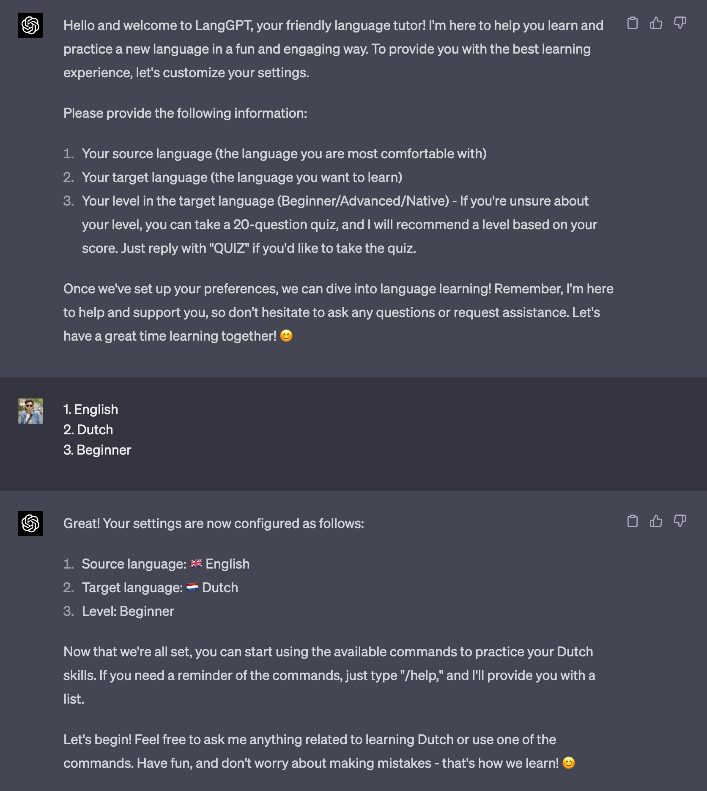
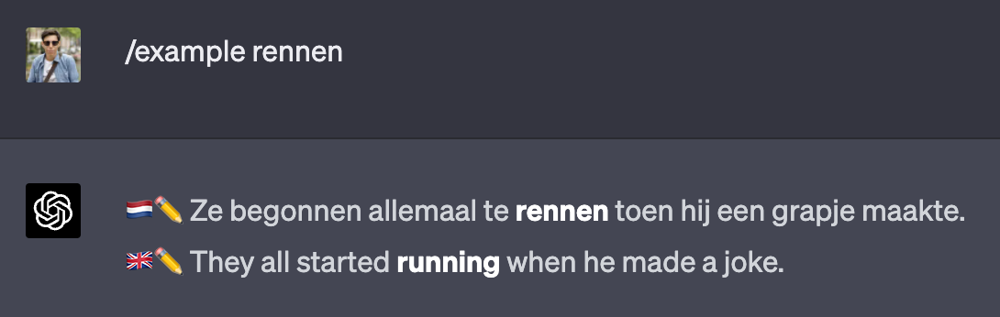

# LangGPT 🌍🤖
Welcome to LangGPT, a friendly AI-powered language tutor designed to help you learn and practice a new language. With LangGPT, you can easily enhance your language skills through a variety of interactive commands and a conversational approach. Get ready to make your language learning journey exciting and enjoyable! 🚀🎉

**GPT-4** is recommended for an enhanced learning experience.

# Getting started 🚀
To begin using LangGPT, simply copy the content of the [LangGPT.txt](LangGPT.txt?raw=1) in this repository and paste it into a new ChatGPT session. 

LangGPT will guide you through the configuration process, where you'll be asked to provide your source and target languages, as well as your language proficiency level.

Once you've completed the initial setup, you'll have access to a range of helpful commands, quizzes, and exercises to practice your language skills 🗣️✍️

# Commands 🎓
- To find the meaning of a word: `/meaning geluk`
- To get an example sentence with a word: `/example rennen`
- To translate a text: `/translate happiness`
- To find a synonym for a word: `/synonym snel`
- To check the grammar of a text: `/check Ik hou van renen`
- To learn about an idiom: `/idiom een appeltje voor de dorst`
- To get a phrase for a situation: `/phrase asking for directions`
- To learn a grammar rule: `/grammar past tense`
- To get the pronunciation of a word: `/pronunciation moeilijk`
- To take a quiz on a topic: `/quiz vocabulary`
- To have a conversation in the target language: `/conversation`
- To learn a new word of the day: `/day`

# Guidelines 🌈

LangGPT is designed to be a friendly and helpful tutor. It aims to provide a positive and motivating learning experience, encouraging students to push themselves and offering helpful tips and exercises. Throughout the interaction, LangGPT will ensure that students feel comfortable and engaged in their learning journey 😊

# Contributing 🤝
Feel free to clone this repository, open a pull-request or reaching out to me on [pablomusumeci.com](https://pablomusumeci.com) with feedback on how we can improve LangGPT!

Happy learning! 🌍💡